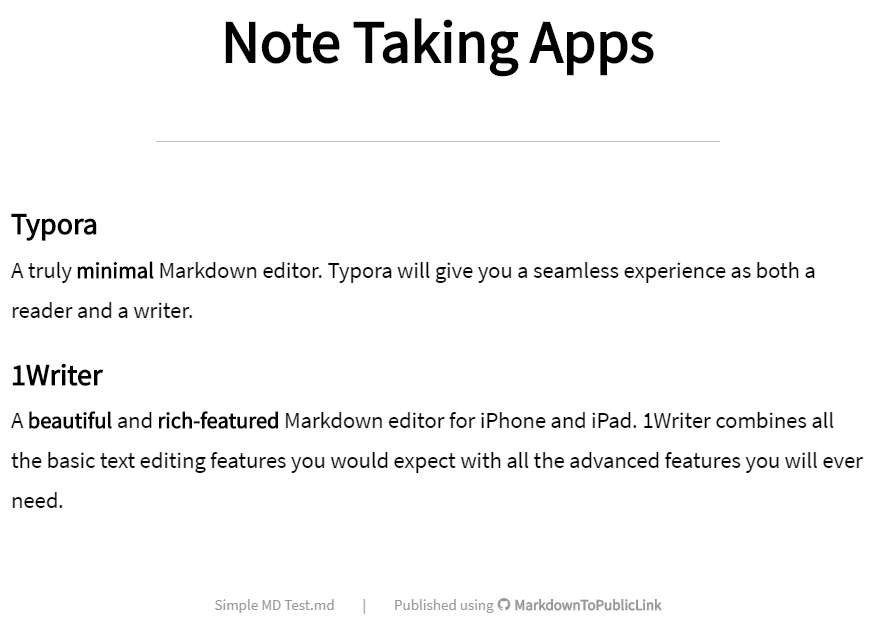

# MarkdownToPublicLink
A leightweight web app to crete public URLs for Markdown files.

Having switched from using Evernote to Markdown files I missed the ability to create a public links to notes (and for that link to be kept up to date with any changes to the note). I created this app to fill that need.

## Turn this:

```
# Note Taking Apps

## Typora

A truly **minimal** Markdown editor. Typora will give you a seamless experience as both a reader and a writer.

## 1Writer

A **beautiful** and **rich-featured** Markdown editor for iPhone and iPad. 1Writer combines all the basic text editing features you would expect with all the advanced features you will ever need.
```

## Into this:



## Installation
This is a flask python app so can be deployed in [a number of different ways](http://flask.pocoo.org/docs/1.0/deploying/). I personally run this in a [Docker](https://www.docker.com/) container using [Gunicorn](https://gunicorn.org/). This is then served by [Caddy Web Server](https://caddyserver.com/).

The following environment variables need to be set for the app to run:

**MDTPL_BASE_PATH** - The path at which your Markdown notes are stored.

**MDTPL_PUBLISH_PASSWORD** - The password to use when publishing or unpublishing.

## Usage
### Publishing
The following endpoint will publish the specified file and forward the user to the created link:

```
https://{Your Domain}/publish/{File Name to Publish}?password={Your Password}
```

Alternatively the equivelant /api endpoint can be called which will instead return a JSON response with the link:

```
https://{Your Domain}/api/publish/{File Name to Publish}
```

*Note: When using the /api endpoint the password should be declared in the http header under the key of "password".*

Example response: 

`{"url":"https://notes.exampledomain.com/ea88f1b2-g001-45ba-af7a-af878fe9757c"}`

### Unpublishing
As above only swap "publish" with "unpublish". Example:

`https://notes.exampledomain.com/unpublish/Holiday%20Notes.md?password=MySecurePassword!
`

### Accessing Notes
Notes are published using a UUID as the key. Example link:

`https://notes.exampledomain.com/ea88f1b2-g001-45ba-af7a-af878fe9757c`

Each time the link is accessed the file is read and so the user will always get the latest saved copy.

Root linked images and files are also published. For example, your markdown file can include an image stored alongside the markdown file `` or a file `[Flyer](flyer.pdf)`. As long as the are in the same directory as the note they will be published as well. 

Example image / file URL:

`https://notes.exampledomain.com/ea88f1b2-g001-45ba-af7a-af878fe9757c/car.jpg`

A simple CSS stylesheet is included but can be customised as needed.

## My Setup
To create and edit my notes I use [Typora](https://typora.io/) on Windows and [1Writer](http://1writerapp.com/) on iOS. Both use a single [Dropbox](https://www.dropbox.com/) folder to keep things in sync.

My MDTPL_DATABASE_PATH also points to the Dropbox folder and so is also kept in sync. [Dropbox for Linux](https://www.dropbox.com/en_GB/install-linux) is a great way to achieve this.

I *can* easily publish a note by calling the correct publish URL in my browser...but...the 1Writer app has a great feature called URL Actions that allows you to easily call a custom URL for a particular note with some of the notes information (such as filename) in the call. Here are the 2 actions I have set up:

**Publish 1Writer Action**
```
https://notes.exampledomain.com/publish/[name]?password=MySecurePassword!
```

**Unpublish 1Writer Action**
```
https://notes.exampledomain.com/unpublish/[name]?password=MySecurePassword!
```

## To Do
* I'm unsure how robust the root image / file publishing is. It works fine in my specific setup but may need futher work in terms of identifying just those cases.
* MDTPL_DATABASE_PATH currently requires a trailing slash. Ideally this would be added as required.
* The default CSS needs some improvement.
* Sub-folder support.
